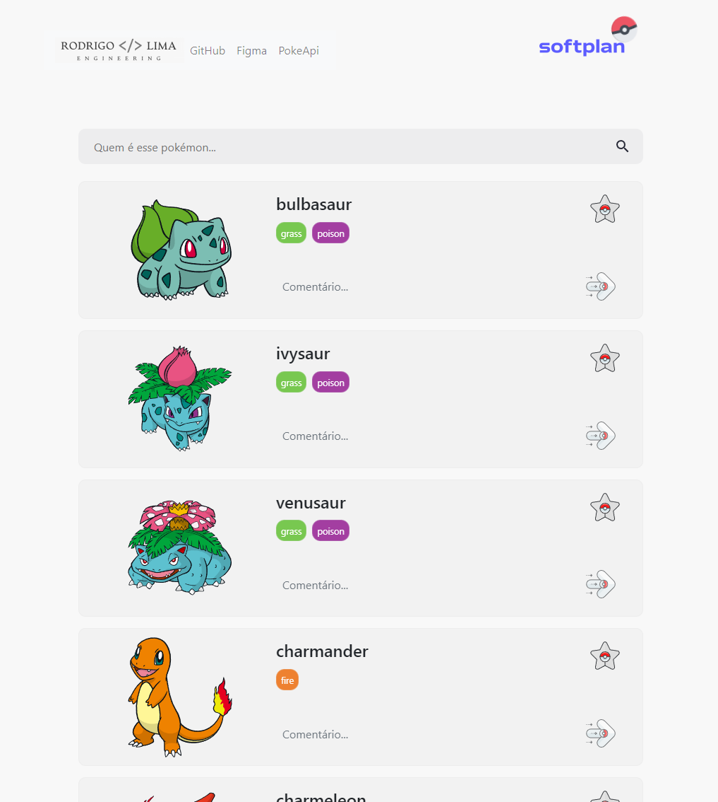

<h1 align="center">Pokedex</h1>


<p align="center">
  

  

  

</p>

<div align="center" id="top"> 
  <a href="https://pokedex.rodrigolima.tech">Demo</a>
</div>

<hr>


<br>

## :dart: Sobre ##

Essa aplicação é um frontend de uma pokedex pokemon construída em Angular, permitindo aos usuários explorar, filtrar, favoritar e comentar sobre diferentes Pokémons de uma maneira interativa e moderna.

Com a integração da [PokeAPI](https://pokeapi.co/docsv2), a aplicação proporciona uma experiência de navegação agradável e envolvente para os fãs de Pokémon.

## :sparkles: Funcionalidades ##

- ✔️ Listar Pokémons: Explore a variedade de Pokémons disponíveis na PokeAPI.
- ✔️ Filtrar Pokémons: Localize os Pokémons que você deseja visualizar.
- ✔️ Favoritar Pokémons: Guarde os seus Pokémons favoritos para fácil acesso. (LocalStorage do browser)
- ✔️ Comentários sobre Pokémons: Partilhe as suas opiniões e comentários sobre os seus Pokémons favoritos. (LocalStorage do browser)
- ✔️ Visualizar detalhes do Pokémon: Clique em qualquer Pokémon para visualizar mais detalhes em uma outra rota.

## :rocket: Tecnologias ##

As seguintes ferramentas foram usadas na construção do projeto:

- [Angular](https://angular.io/)
- [Bootstrap](https://getbootstrap.com/docs/4.6/content/reboot/)
- [Figma](https://www.figma.com/)
- [Angular CLI version 16.1.6](https://github.com/angular/angular-cli)

## 🤠 Características do Projeto ##

Este projeto foi construído usando vários recursos e práticas recomendadas do Angular, incluindo:

- ✔️ Services: Utiliza Services do Angular para lidar com a lógica de negócios e interações com APIs.
- ✔️ Lazy Loading: Usa o recurso de Lazy Loading do Angular para carregar componentes de maneira eficiente e apenas quando necessário.
- ✔️ Diretivas: Diretivas do Angular são usadas para manipular o DOM e modificar a aparência e o comportamento dos componentes e elementos.
- ✔️ FormControls: Este projeto utiliza FormControls do Angular para gerenciar os valores e validação dos formulários no projeto.

## :white_check_mark: Pré requisitos ##

Antes de começar :checkered_flag:, você precisa ter o [Git](https://git-scm.com) e o [Node](https://nodejs.org/en/) instalados em sua máquina. Além disso, é recomendável ter um editor de texto, como o [VSCode](https://code.visualstudio.com/).

## :checkered_flag: Começando ##
```bash
# Clone este repositório
$ git clone https://github.com/zrodrigolimaz/pokedex-angular

# Entre na pasta
$ cd pokedex

# Instale as dependências
$ npm install

Depois disso vamos rodar o projeto

# Servidor de desenvolvimento

É necessário também instalar o Angular CLI:
Vamos usar isso para rodar o nosso servidor de desenvolvimento.
$ npm install -g @angular/cli

Após instalação 
Execute `ng serve` 
# O app vai inicializar em
<http://localhost:4200/>
```
## Executando testes unitários

Execute `ng test` para realizar os testes unitários através do [Karma](https://karma-runner.github.io).

## Executando testes de ponta a ponta

Execute `ng e2e` para realizar os testes de ponta a ponta através de uma plataforma de sua escolha. Para utilizar este comando, você precisa adicionar um pacote que implemente capacidades de teste de ponta a ponta.
